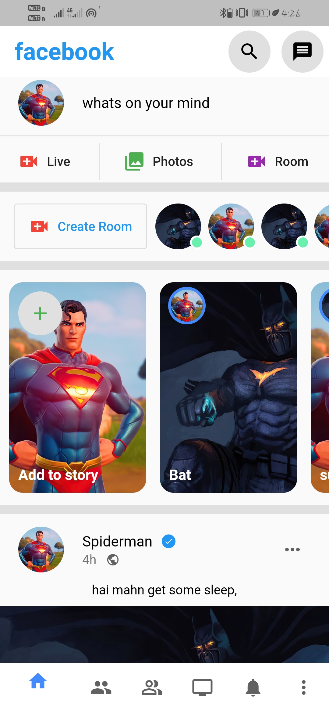
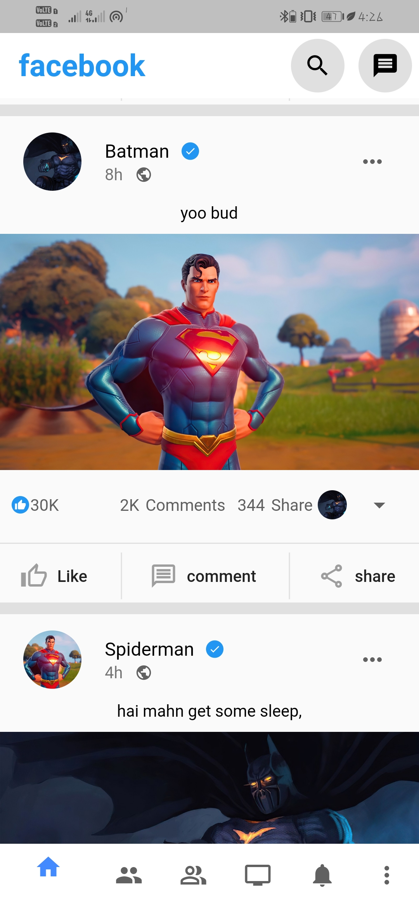
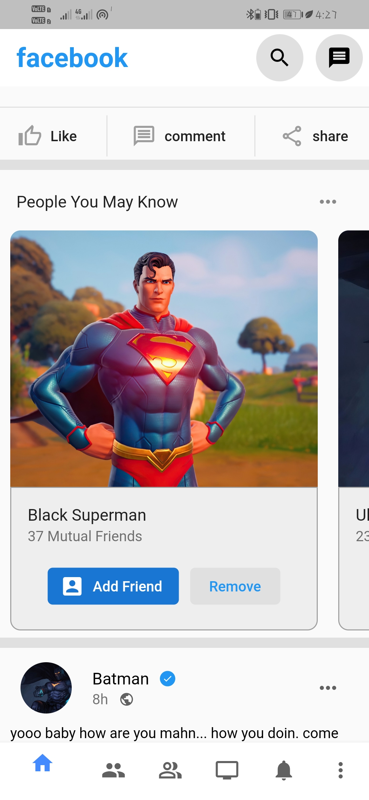

# FLUTTER FACEBOOK UI CLONE
### This facebook UI clone is done with Google's Flutter....
### Its highly widget refactored (reusable widgets)....
### You can download the Apk from the download folder....
### download => app-release.apk
 

<table border=0>
  <tr>
    <th></th>
    <th></th>
    <th></th>
  </tr>
  </table>
